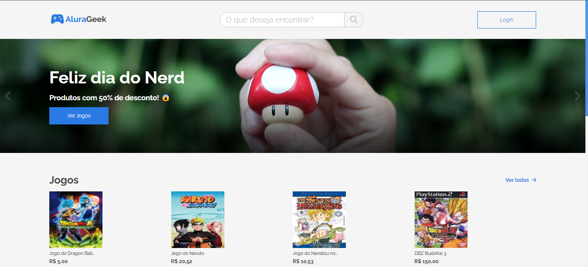

# AluraGeek - Desafio 02 Alura + Oracle
## Objetivo do Projeto
Este projeto foi desenvolvido como parte do projeto ONE da Alura e Oracle. O objetivo era criar um e-commerce completo implementando as operações de CRUD - Criação (Create), Leitura (Read), Atualização (Update) e Deleção (Delete) de produtos. Durante o desenvolvimento, trabalhamos intensivamente com requisições a uma API e a manipulação de funções assíncronas.
## Visualização do Projeto
### Aqui estão algumas capturas de tela da nossa aplicação:

## :blue_book: Aplicação e Tecnológias
|  |     |
| -------------  | --- |
| ✏️ Nome        | **Alurageek**
| 💻 Tecnologias | HTML, CSS, JavaScript
| 🔗 URL         | https://alurageek-394e56.netlify.app
| 🔥 Desafio     | https://www.alura.com.br/challenges/oracle-one-front-end/alurageek/alurageek-sprint02

## Agradecimentos

Gostaria de expressar minha gratidão à Alura e à Oracle por proporcionarem esta oportunidade de aprendizado e aprimoramento das minhas habilidades em desenvolvimento frontend. Foi um desafio muito interessante e gratificante.

## Referências:

- 🔗 ALURA: https://www.alura.com.br/
- 🔗 MDN: https://developer.mozilla.org/pt-BR/
- 🔗 W3SCOOLS: https://www.w3schools.com/
